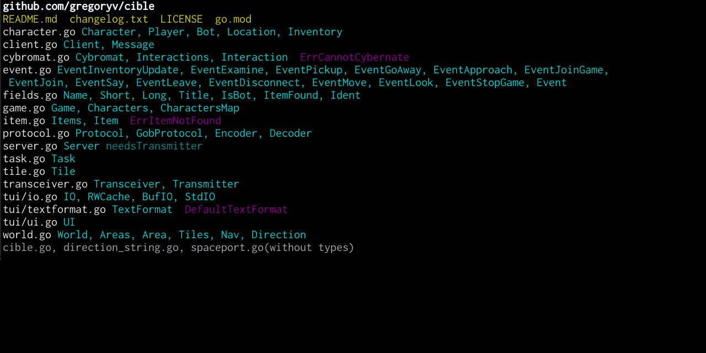

ARCHIVED! Moved to https://sogvin.com/goproject

main - show outline of go projects

This tool helps you with getting a sense of *Where* types are declared
and *What* makes up a specific project.

## Quick start

    $ go install github.com/gregoryv/goproject@latest
    $ goproject -h

